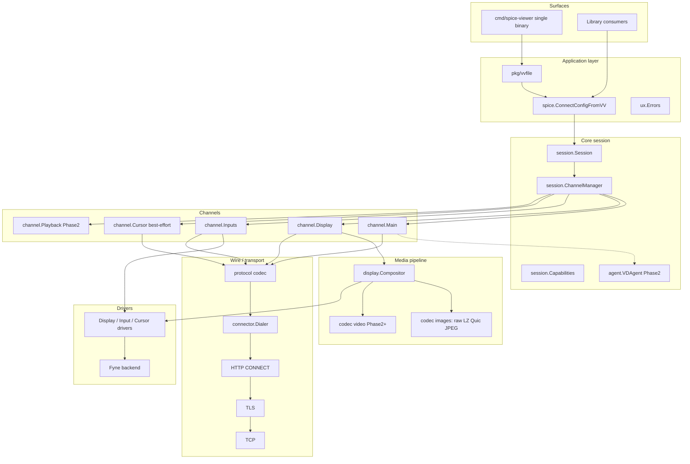
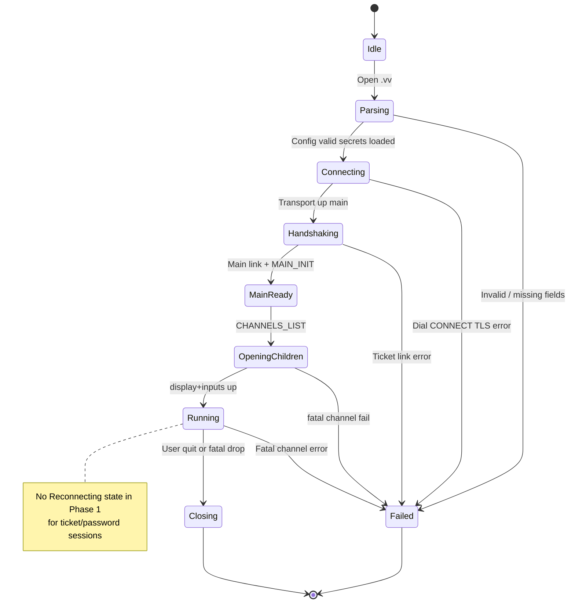
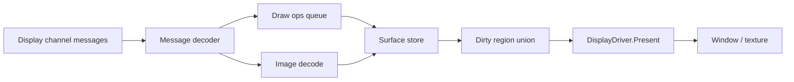
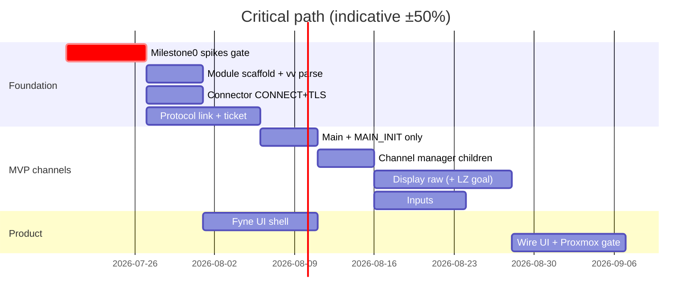

# Modern SPICE Viewer in Go (virt-viewer)

| Field | Value |
|-------|-------|
| **Title** | Modern SPICE Viewer in Go — Systems Design |
| **Author** | TBD |
| **Date** | 2026-07-17 |
| **Status** | Approved (rev 4 — user license decision); implementation not started |
| **Workspace** | `/Users/antonio/Projects/virt-viewer` |
| **Audience** | Senior engineers implementing a greenfield SPICE client |

---

## Overview

This document specifies a greenfield, library-first SPICE remote display client written primarily in Go. The product goal is a single-binary, cross-platform client (macOS, Linux, Windows) with **first-class Proxmox Console support**: opening a downloaded `pve-spice.vv` file must establish a working session through Proxmox’s HTTP CONNECT spiceproxy, TLS with embedded CA + `host-subject` verification, and SPICE ticket authentication. Phase 1 is defined by that path succeeding with main, display, and inputs channels (cursor best-effort)—not by full spice-gtk feature parity.

Architecture is layered: connectors → wire protocol → session/channel manager → codecs → guest agent → UI drivers. The protocol stack is a reusable Go module; CLI and GUI are thin consumers. **Repository license is Apache-2.0. Phase 1 is pure Go only** (no spice-common C, no FFmpeg, no libusb). Hybrid/native deps remain a **separate future decision** (GPL spice-common linkage is incompatible with a pure Apache-2.0 binary without a later license change or dual-license process). Phased delivery starts with Proxmox MVP, then progressive channel and codec parity with remote-viewer/spice-gtk. **Approved for implementation when the team is ready; no code yet.**

---

## Background & Motivation

### Current state

- **Reference stack**: spice-protocol headers + spice-gtk + virt-viewer/`remote-viewer`. virt-manager embeds spice-gtk for management UIs.
- **Proxmox path**: UI “Console → SPICE” calls `POST /api2/spiceconfig/nodes/{node}/qemu/{vmid}/spiceproxy`, downloads a short-lived virt-viewer INI (`.vv`) containing host token, TLS port, password ticket, HTTP proxy, PEM CA, and subject DN.
- **Existing Go / related**:
  - [Shells-com/spice](https://github.com/Shells-com/spice) — pure Go client library, incomplete parity; useful bootstrap for message layouts and channel framing.
  - [jsimonetti/go-spice](https://github.com/jsimonetti/go-spice) — proxy-oriented, not a full client.
  - Other partial clients / writeups (e.g. shakenfist and similar link-layer experiments) may be consulted for handshake details; none replace spice-gtk as normative.
  - MoxySpice — Proxmox helper that shells out to an external client (not a protocol implementation).

### Pain points

1. macOS users often lack a polished, maintained SPICE client that handles Proxmox’s non-DNS `pvespiceproxy:` host + CONNECT + custom CA/subject flow.
2. spice-gtk + virt-viewer is C-centric, heavy to ship as a single binary, and awkward for custom tooling.
3. Tickets expire quickly; errors are often opaque (“connection failed”) rather than “ticket expired / re-open Console”.
4. No well-maintained Go library that both implements SPICE channels and documents the Proxmox connector path.

### Why now

A pure-Go library + modern UI can deliver a single binary, clearer diagnostics, reusable APIs for automation, and a clear roadmap toward remote-viewer parity—starting with the Proxmox use case that most operators actually hit.

### Normative sources (Milestone 0 must pin commits)

| Concern | Normative reference (confirm in Milestone 0 memo) |
|---------|-----------------------------------------------------|
| Wire structs, message IDs, caps | `spice-protocol` headers (`spice/protocol.h`, `spice/enums.h`, channel headers) |
| Link ticket crypto | spice-gtk client link code + QEMU spice server auth (RSAES-OAEP SHA-1) |
| `.vv` keys / delete semantics | virt-viewer man page (`virt-viewer(1)` / connection file docs) |
| Proxmox CONNECT path | PVE spiceproxy + public `pve-spice.vv` examples |
| DN / subject check behavior | spice-gtk / gnutls subject verify path used by remote-viewer |

Milestone 0 decision memo **must cite specific upstream file paths and commit SHAs** used as normative. Claims in this design about external systems were validated against public docs and third-party writeups; **crypto and DN matching must be re-proven against source before session/channel PRs (PR 06–11)**. Foundation PRs that do not implement session link logic (PR 01–03, PR 05 UX) may proceed in parallel once the module exists; **PR 04 requires PR 00 ticket vector/interop**.

---

## Goals & Non-Goals

### Goals

1. **Single binary** client for macOS, Linux, Windows.
2. **Proxmox `.vv` end-to-end** in Phase 1: parse, CONNECT, TLS, link handshake, display + input.
3. **Library-first** module so GUI, CLI, and headless tools share one session stack.
4. **Progressive SPICE parity**: main, display, inputs first; cursor best-effort; then agent, audio, streams, USB, WebDAV.
5. **Modern UX**: HiDPI, clear disconnect messaging (no misleading auto-reconnect on tickets), ticket-expiry clarity, keyboard grab/release, fullscreen toggles from `.vv` hotkeys.
6. **Security hygiene**: secrets never logged; `delete-this-file=1` honored early; CA/subject enforced; parser bounds.
7. **Testable**: golden `.vv` fixtures, recorded sessions, interop matrix with QEMU + remote-viewer.

### Non-Goals (initial)

1. Full virt-manager / VM lifecycle management UI.
2. VNC, RDP, or multi-protocol “remote-viewer” parity beyond SPICE (SPICE-only product).
3. Bit-perfect GLZ/GL codec parity on day one.
4. Smartcard, USB-redir, spiceport, WebDAV, or **vdagent** in Phase 1 (agent **disabled**).
5. Replacing QEMU’s SPICE server; client-only.
6. Web/WASM-first client as primary surface (may exist later as consumer of the library).
7. Implementing Proxmox API login UI; optional later “fetch spiceconfig via API” is secondary to file open.
8. Improving upstream remote-viewer/spice-gtk packaging as the product (see Alternatives).
9. Auto-reconnect for short-lived Proxmox tickets.

---

## Proposed Design

### High-level architecture



### Module and package layout

**Blocking before PR 01**:

1. **Go module path** — still **TBD** (placeholder: `github.com/PLACEHOLDER/virt-viewer` — do not merge PR 01 without a real path).
2. **License** — **resolved: Apache-2.0**. PR 01 ships `LICENSE` as Apache-2.0. Phase 1 remains pure Go; do **not** link GPL code (e.g. spice-common) into the Apache-2.0 binary without a separate future license decision (relicense, dual-license, or drop hybrid).

```
/Users/antonio/Projects/virt-viewer/
├── go.mod
├── go.sum
├── README.md
├── LICENSE
├── cmd/
│   └── spice-viewer/          # Single v0.1 binary: GUI by default; --headless for tests
├── internal/
│   ├── connector/              # Dialer: TCP, TLS, HTTP CONNECT
│   ├── protocol/               # REDQ framing, link messages, enums, caps bits
│   ├── session/                # Session lifecycle, channel manager, no auto-reconnect (P1)
│   ├── channel/
│   │   ├── main.go
│   │   ├── display.go
│   │   ├── inputs.go
│   │   ├── cursor.go
│   │   ├── playback.go         # Phase 2
│   │   ├── record.go           # Phase 3
│   │   ├── usbredir.go         # Phase 3
│   │   ├── port.go
│   │   └── webdav.go
│   ├── codec/
│   │   ├── raw.go
│   │   ├── lz.go
│   │   ├── quic.go             # Phase 2
│   │   ├── jpeg.go             # Phase 2
│   │   ├── glz.go              # Phase 3 pure Go or hybrid — license gated
│   │   ├── mjpeg.go
│   │   └── h264.go             # hybrid optional, license gated
│   ├── display/
│   ├── agent/                  # Phase 2; not started in Phase 1
│   ├── security/               # ticket OAEP, zeroize helpers
│   ├── ux/                     # error classification (CLI + GUI)
│   └── ui/                     # Fyne only; cmd may import internal/ui
│       ├── app.go
│       ├── window.go
│       ├── grab.go
│       └── backend_fyne.go
├── pkg/
│   ├── spice/
│   │   ├── client.go
│   │   ├── config.go           # ConnectConfig, ConnectConfigFromVV
│   │   ├── options.go
│   │   ├── events.go
│   │   └── driver.go
│   └── vvfile/
│       └── parse.go            # only public .vv API; cmd uses this, not internal/vv
├── testdata/
│   ├── vv/
│   ├── records/
│   ├── certs/
│   └── vectors/                # ticket crypto + DN match goldens
├── scripts/
│   ├── interop_qemu.sh
│   └── milestone0_memo.md      # filled during spike
├── docs/
│   └── proxmox.md
└── third_party/
    └── NOTES.md
```

**Import rules (enforced in CI from Milestone 1)**

| From | May import |
|------|------------|
| `cmd/spice-viewer` | `pkg/*`, `internal/ui`, `internal/ux` only (not `internal/vv`, `internal/protocol`, …) |
| `pkg/spice` | `internal/*` as needed (library root) |
| `pkg/vvfile` | stdlib + minimal helpers; no UI |
| `internal/protocol`, `connector`, `codec`, `session`, `channel` | **no** Fyne/Gio/UI imports |
| `internal/ui` | `pkg/spice`, `pkg/vvfile`, `internal/ux` |

CI: `depguard` / `importlint` / custom `go list` check — **Milestone 1 Definition of Done**.

### Connection / session lifecycle (including Proxmox)

#### `.vv` key support matrix (Phase 1)

| Key | Phase 1 | Behavior |
|-----|---------|----------|
| `type` | **Required** | Must be `spice`; else error |
| `host` | **Required** | Opaque CONNECT host token; never DNS-normalize |
| `tls-port` | **Required** for PVE / TLS | Destination port after CONNECT |
| `port` | Optional | Non-TLS debug only when `tls-port` absent |
| `password` | **Required** | Ticket; max **85** bytes (OAEP-SHA1 budget; see Ticket encryption) |
| `proxy` | Optional | HTTP proxy URL; TCP dial target for CONNECT |
| `ca` | **Required** when TLS | Unescape `\n` / `\\n`; PEM → pool |
| `host-subject` | **Required** when Proxmox-style TLS pin | DN match after chain verify |
| `title` | Optional | Window title |
| `delete-this-file` | Optional | Default honor if `1` (see deletion policy) |
| `secure-attention` | Optional | **Client hotkey** binding → inject guest CAD |
| `release-cursor` | Optional | Client hotkey → ungrab |
| `toggle-fullscreen` | Optional | Client hotkey |
| `fullscreen` | Optional | If `1`, start fullscreen |
| `enable-usbredir` | **Ignored** | Phase 3 |
| `secure-channels` | **Ignored** | Parse OK; no behavior P1 |
| `version` / `versions` | **Ignored** | Safely ignore unknown/unsupported |
| unknown keys | **Ignored** | Forward-compatible; debug-log once |

#### Example Proxmox download

```ini
[virt-viewer]
type=spice
host=pvespiceproxy:687d1ec6:10016:pve::dcc9e35662ef0b1233e12ac02880ea7851f9218e
host-subject=OU=PVE Cluster Node,O=Proxmox Virtual Environment,CN=pve.example.com
tls-port=61002
password=<short-lived-ticket>
proxy=http://proxmox.example.com:3128
ca=-----BEGIN CERTIFICATE-----\n...\n-----END CERTIFICATE-----\n
title=VM 10016 - debian-spice
delete-this-file=1
secure-attention=Ctrl+Alt+Ins
release-cursor=Ctrl+Alt+R
toggle-fullscreen=Shift+F11
```

#### `delete-this-file` policy (explicit)

1. Parse file → validate required keys → **copy secrets into memory** (`[]byte` password, PEM bytes).
2. If `delete-this-file=1` **and** `ParseOptions.DeleteIfRequested == true`:
   - Call `os.Remove(path)` **immediately**, **before** dial/CONNECT, independent of later session success.
   - Rationale: minimize on-disk ticket lifetime; user must re-download Console file after any failure (same as re-open after expiry).
3. **Go zero-value semantics**: `ParseOptions{}` has `DeleteIfRequested == false`, so library callers who pass zero options **do not delete** (safe library default—callers must opt in). `cmd/spice-viewer` **always** sets `DeleteIfRequested: true` so virt-viewer semantics apply for the product binary. Deletion may be skipped only via an explicit future CLI flag (e.g. `--keep-vv`); no such flag in Phase 1.
4. If remove fails: **warn** user (stderr + GUI toast); do **not** fail the session. Retry once after 100ms on Windows (browser file lock). virt-viewer fails silently; we warn (better security UX).
5. Tests: “delete even if CONNECT fails” (CLI options); “zero-value ParseOptions does not delete”; “warn path when remove denied”.

#### Dial sequence (Proxmox) — full multi-channel

```mermaid
sequenceDiagram
  participant UI as spice-viewer
  participant VV as pkg/vvfile
  participant S as session.Session
  participant D as connector
  participant P as spiceproxy :3128
  participant Q as QEMU SPICE

  UI->>VV: ParseFile(path, DeleteIfRequested)
  VV->>VV: Validate keys, copy secrets
  alt delete-this-file=1
    VV->>VV: os.Remove(path) before dial
  end
  UI->>S: Connect(ConnectConfigFromVV)
  Note over S: Phase 1: no auto-reconnect
  S->>D: DialSPICE(proxy, opaque host, tls-port, ca, subject)
  D->>P: TCP to proxy host:port only
  D->>P: CONNECT opaqueHost:tlsPort HTTP/1.1
  P-->>D: 200 Connection Established
  D->>Q: TLS (RootCAs=ca; no SNI=token)
  D->>D: Verify chain + host-subject DN
  S->>Q: SpiceLinkMess main connection_id=0
  Q-->>S: SpiceLinkReply RSA pubkey + caps
  S->>Q: AuthSpice ticket ciphertext
  Q-->>S: Link result OK
  Q-->>S: SPICE_MSG_MAIN_INIT session_id
  S->>S: store connection_id = session_id
  Q-->>S: SPICE_MSG_MAIN_CHANNELS_LIST
  par Parallel child links same ticket
    S->>Q: display link connection_id=session_id
    S->>Q: inputs link connection_id=session_id
    S->>Q: cursor link connection_id=session_id (best-effort)
  end
  Note over S,Q: Each child: fresh RSA pubkey, re-encrypt ticket
  S-->>UI: SessionRunning first frame
```

#### CONNECT authority algorithm (critical)

Proxmox `host` is **not** a DNS name or IPv6 literal. It contains multiple colons, e.g.  
`pvespiceproxy:687d1ec6:10016:pve::dcc9e356…`.

**Do not** call `net.SplitHostPort`, `net.JoinHostPort`, or URL hostname parsers on `ep.Host`.

```go
// Construct CONNECT request-target and Host header:
//   connectTarget = ep.Host + ":" + strconv.Itoa(ep.Port)
// where ep.Host is the literal .vv "host" value and ep.Port is tls-port.

func connectAuthority(host string, port int) string {
    // host may contain ':', including "::" substrings — treat as opaque.
    return host + ":" + strconv.Itoa(port)
}

// TCP dial address is ONLY the proxy:
//   proxyURL.Host  e.g. "proxmox.example.com:3128"
// After 200, TLS is negotiated on the tunneled conn.
// tls.Config.ServerName MUST be empty / not set to the pvespiceproxy token.
```

Unit tests **must** use real-shaped tokens (sanitized fixtures):

```
pvespiceproxy:687d1ec6:10016:pve::dcc9e35662ef0b1233e12ac02880ea7851f9218e
```

Assert CONNECT line equals  
`CONNECT pvespiceproxy:687d1ec6:10016:pve::dcc9e35662ef0b1233e12ac02880ea7851f9218e:61002 HTTP/1.1`.

#### Connector interface

```go
type Endpoint struct {
    // Host is the CONNECT tunnel target hostname/token (opaque). Never SplitHostPort.
    Host string
    // Port is tls-port (or port for cleartext debug).
    Port int
    // Proxy is the real TCP peer for CONNECT mode; nil = direct dial Host:Port
    // using special directDialAddress() that still avoids SplitHostPort on opaque hosts.
    Proxy *url.URL
    TLS   *TLSParams // nil = cleartext (lab only)
}

type TLSParams struct {
    RootCAs     *x509.CertPool // required if TLSParams non-nil
    HostSubject string         // if non-empty: Proxmox subject pin mode
    // ServerName: only for direct DNS hosts when HostSubject == ""
    ServerName string
}

type Dialer interface {
    DialSPICE(ctx context.Context, ep Endpoint) (net.Conn, error)
}
```

**Endpoint validation matrix**

| Mode | proxy | TLS | ca | host-subject | ServerName | Result |
|------|-------|-----|----|--------------|------------|--------|
| Proxmox | set | yes | required | required | empty | CONNECT + chain verify + DN pin |
| Direct TLS DNS | empty | yes | system or custom | empty | = host | standard Verify with DNS SAN |
| Direct TLS pin | empty | yes | required | set | empty | chain verify + DN pin |
| Missing ca + TLS | any | yes | empty | any | any | **hard error** before dial |
| Cleartext lab | empty | no | n/a | n/a | n/a | only if explicit `AllowCleartext` |

#### TLS + `host-subject` verification algorithm (Go)

Proxmox mode uses `InsecureSkipVerify: true` **only** to disable Go’s hostname check, then **manual** verification:

```text
VerifyPeerCertificate(rawCerts, _ /* verifiedChains unused */):
  1. If len(rawCerts) == 0 → error
  2. Parse all certs; leaf = certs[0]; intermediates = rest
  3. opts = x509.VerifyOptions{
       Roots: RootCAs,              // from .vv ca only (not system pool) for PVE
       Intermediates: intermediates pool,
       CurrentTime: time.Now(),
       KeyUsages: []x509.ExtKeyUsage{ExtKeyUsageServerAuth},
       // DNSName intentionally unset in pin mode
     }
  4. chains, err = leaf.Verify(opts); err != nil → reject (time, chain, KU)
  5. If HostSubject != "":
       if !subjectMatches(leaf.Subject, HostSubject) → reject
     Else:
       // Direct DNS mode should use normal tls with ServerName instead of this path
       reject if ServerName empty
  6. return nil
```

**DN match algorithm** (do **not** use `pkix.Name.String()` vs Proxmox string equality):

```text
subjectMatches(certSubject pkix.Name, hostSubject string) bool:
  // hostSubject is OpenSSL-style: "OU=...,O=...,CN=..."
  expected = parseDN(hostSubject)  // split on unescaped commas; parse TYPE=value
  // Compare set of RDNs we care about (order-independent for multi-valued):
  return equalFold(certSubject.CommonName, expected.CN)
     && stringSliceEqual(certSubject.Organization, expected.O)
     && stringSliceEqual(certSubject.OrganizationalUnit, expected.OU)
  // Optionally also C, ST, L if present in expected
  // Escape handling: support "\," in values if seen in wild
```

Golden tests: real PVE-like cert subject + exact `host-subject` string from fixture `.vv`.  
Milestone 0: compare behavior to remote-viewer on same file; document any intentional differences.

**stdlib crypto**: RSAES-OAEP uses `crypto/rsa.EncryptOAEP` with `sha1.New()` — no `x/crypto` required for Phase 1 ticket path.

#### Session lifecycle states (Phase 1)



**Reconnect policy (Phase 1)**

- **No auto-reconnect** when auth is password/ticket (Proxmox and typical QEMU password).
- On fatal disconnect: emit `EventDisconnected` with class `TicketOrSessionDead` / `Transport` and UX string: *“Connection lost. Open Console again in Proxmox to download a new connection file.”*
- Optional later: `AllowReconnect: true` only for long-lived lab passwords, **off by default**, not used for `.vv` ticket sessions.

**Error classification (`internal/ux`)** — available to CLI before GUI exists:

| Condition | Class | User message (example) |
|-----------|-------|------------------------|
| TLS subject mismatch | `TLSSubject` | Certificate subject does not match connection file |
| Chain/ca fail | `TLSTrust` | Cannot validate server certificate |
| CONNECT failure | `Proxy` | Cannot reach Proxmox spiceproxy |
| Link error bad password | `Ticket` | Ticket invalid or expired — open Console again in Proxmox |
| Child channel ticket fail | `Ticket` | Same as above (TTL raced multi-channel open) |
| EOF mid-session | `Transport` | Connection lost — re-open Console for a new ticket |
| Unsupported type | `Config` | Not a SPICE connection file |
| Parser limit | `Config` | Connection file rejected (field too large) |

### Channel model and capability negotiation

SPICE uses **one TCP/TLS connection per channel**. Each channel repeats the full link handshake with its own RSA pubkey and a **fresh ticket ciphertext**.

#### Multi-channel lifecycle (normative for implementers)

1. **Main link**: `SpiceLinkMess.connection_id = 0`, `channel_type = MAIN`, `channel_id = 0`.
2. Complete link auth (ticket).
3. Wait for **`SPICE_MSG_MAIN_INIT`**: read `session_id` (and other fields: display_channels_hint, etc.). Set `ChannelManager.connectionID = session_id`.
4. **Do not** open child channels before step 3.
5. Wait for **`SPICE_MSG_MAIN_CHANNELS_LIST`** (or equivalent channel announcement used by server). For each listed channel that we support and want:
   - Dial new CONNECT+TLS (same `Endpoint`).
   - `SpiceLinkMess.connection_id = session_id`.
   - `channel_type` / `channel_id` from list.
   - Re-encrypt ticket with **that** channel’s `SpiceLinkReply` pubkey.
6. Phase 1 **required children**: `DISPLAY` (id usually 0), `INPUTS`.  
   Phase 1 **best-effort**: `CURSOR` — failure logs warning; session continues (server-drawn cursor often sufficient).
7. Phase 1 **do not open**: playback, record, smartcard, usbredir, port, webdav.
8. Open children with **high parallelism** (errgroup, limit 4–8) immediately after list to **beat Proxmox ticket TTL**.

#### Fatal vs degradable channel errors

| Channel | Failure during open | Failure while running |
|---------|---------------------|------------------------|
| Main | **Session fatal** | **Session fatal** |
| Display | **Session fatal** | **Session fatal** |
| Inputs | **Session fatal** | **Session fatal** (no keyboard/mouse) |
| Cursor | Degrade; warn | Degrade; hide/use default |
| Others (P2+) | Don’t open in P1 | n/a |

#### `Close()` ordering

```text
1. cancel session context (stops new channel opens via life context)
2. wait for in-flight OpenChannels / child link work with timeout (e.g. 3s)
   — wait *before* closing sockets so mid-link goroutines exit cleanly;
     cancel unblocks blocked dial/link I/O
3. close inputs (stop sending)
4. close display, cursor
5. close main
6. security.Wipe(password)
7. release surfaces
```

Note: waiting for in-flight opens before channel close (step 2) is intentional
and preferred over “close then wait”: cancel already interrupts open work;
closing sockets first races link handshakes that still own the conn.

#### Ticket encryption (exact)

**Auth mechanism**: `SPICE_COMMON_CAP_AUTH_SPICE` → mechanism **`1` (AuthSpice)** only in Phase 1. Do not implement SASL in P1.

**`SpiceLinkReply` public key (on-wire)**

- Field is a fixed **162-byte** RSA **SubjectPublicKeyInfo** DER blob for the historical 1024-bit SPICE server key (spice-protocol / spice-gtk size).
- Parse with `x509.ParsePKIXPublicKey(pubKey[:])` → `*rsa.PublicKey`.
- Phase 1: **reject** any `pub_key` length other than 162, or non-RSA keys, with a clear link/config error (do not attempt encrypt).
- Milestone 0 must confirm 162-byte DER SPKI against pinned spice-protocol/`SpiceLinkReply` layout; if a future server uses longer keys, that is post-P1 work.

**OAEP plaintext budget (1024-bit, SHA-1)**

```
k      = 128          // modulus bytes
hLen   = 20           // SHA-1
maxPT  = k - 2*hLen - 2 = 128 - 40 - 2 = 86 bytes  // including trailing NUL
maxPassword = maxPT - 1 = 85 bytes
```

Parser and `EncryptSpiceTicket` both enforce **password ≤ 85 bytes**. Rejecting at parse avoids mis-classifying oversized tickets as server/`Ticket` auth failures.

**Per channel** (main and every child):

1. Receive `SpiceLinkReply`; parse 162-byte DER SPKI → RSA pubkey (and caps).
2. Build password buffer: UTF-8 ticket bytes from `.vv` **plus terminating NUL** (`password\0`); total ≤ 86 bytes.
3. Ciphertext = **RSAES-OAEP**, hash **SHA-1**, MGF1-SHA1, label empty; output **128 bytes**.
4. Send auth message: `uint32_le mechanism=1` || `ciphertext[128]`.

```go
// internal/security/ticket.go
const (
    SpiceLinkPubKeyDERLen = 162 // 1024-bit RSA SPKI in SpiceLinkReply
    MaxSpicePasswordLen   = 85  // OAEP-SHA1 max plaintext 86 including NUL
)

func ParseLinkPublicKey(der []byte) (*rsa.PublicKey, error) {
    if len(der) != SpiceLinkPubKeyDERLen {
        return nil, fmt.Errorf("spice: pub_key length %d want %d", len(der), SpiceLinkPubKeyDERLen)
    }
    pub, err := x509.ParsePKIXPublicKey(der)
    // ... type-assert *rsa.PublicKey
}

func EncryptSpiceTicket(pub *rsa.PublicKey, password []byte) (ciphertext []byte, err error) {
    if len(password) > MaxSpicePasswordLen {
        return nil, fmt.Errorf("spice: password length %d exceeds OAEP budget %d", len(password), MaxSpicePasswordLen)
    }
    buf := make([]byte, len(password)+1) // NUL-terminated
    copy(buf, password)
    return rsa.EncryptOAEP(sha1.New(), rand.Reader, pub, buf, nil)
}
```

**Golden vectors**: Milestone 0 / PR 04 **must not merge** without either:

- Fixed RSA key + known password → known ciphertext vector from spice-gtk or self-generated with OpenSSL/reference, **or**
- Live interop test: encrypt against QEMU’s advertised key and receive link OK.

**Ticket TTL**: server validates ticket on **every** channel link. Serial open of many channels can fail late with “bad password.” Mitigation: parallel open; fail session with `Ticket` class if any required channel auth fails.

#### Capability advertisement (Phase 1 allowlist)

Advertise **only** what we handle:

| Cap area | Phase 1 |
|----------|---------|
| **Mini header** | **Yes — advertise and implement** (`SPICE_COMMON_CAP_PROTOCOL_AUTH_SELECTION` path as needed; post-link channel data uses **mini-header** framing). Full-header-only is **not** a Phase-1 option unless Milestone 0 proves QEMU rejects mini-header (document and flip only then). |
| AuthSpice | Yes |
| AuthSASL | No |
| Display: basic draw | Yes |
| Display: sized stream | No (P2) |
| Pref compression | Prefer LZ/raw |
| Agent protocol | **Do not** enable agent in P1 |

Never set capability bits for GLZ/H.264/USB until implemented.

**Framing decision (cross-cutting):** After successful link auth, all Phase-1 channel I/O uses the **mini message header** layout from spice-protocol. Every channel PR (main/display/inputs/cursor) shares one `protocol.ReadMessage` / `WriteMessage` implementation—no per-channel guessing.

#### Channel types (phased)

| Channel | Phase | Open policy |
|---------|-------|-------------|
| Main | 1 | Required |
| Display | 1 | Required |
| Inputs | 1 | Required |
| Cursor | 1 | Best-effort |
| Playback | 2 | Optional |
| Record | 3 | Optional |
| Smartcard | later | Off |
| USB redir | 3+ | Off P1 |
| Port | 3 | Off |
| WebDAV | 3 | Off |

#### Channel manager sketch

```go
type ChannelManager struct {
    connectionID uint32          // 0 until MAIN_INIT
    dialer       connector.Dialer
    endpoint     connector.Endpoint
    ticket       []byte          // wiped on Close; never log
    main         *MainChannel
    children     map[ChannelKey]Channel
}

// OpenChildren only after connectionID != 0 and channels_list received.
```

### Display pipeline and codec strategy

SPICE display is a **client-side compositor**: server sends draw operations and images; client maintains surfaces and blits to the window.



#### Phase-1 message / capability allowlist

**Main channel**

| Message | Action |
|---------|--------|
| `SPICE_MSG_MAIN_INIT` | **Handle** — store session_id, mouse modes hints |
| `SPICE_MSG_MAIN_CHANNELS_LIST` | **Handle** — drive child opens |
| `SPICE_MSG_MAIN_NAME` / `UUID` | Handle optional (title) |
| Agent-related | **Ignore** P1 (agent off) |
| `SPICE_MSG_MAIN_MIGRATE_*` | Ignore/fail soft |
| Unknown | Ignore + debug count |

**Display channel (minimum)**

| Message / op | Action |
|--------------|--------|
| Surface create/destroy | **Handle** primary surface |
| `DRAW_FILL` | **Handle** solid fill |
| `DRAW_COPY` | **Handle** |
| `DRAW_OPAQUE` / `DRAW_BLEND` | Handle subset or treat as copy if flags simple |
| Image: RAW | **Handle** |
| Image: LZ | **Handle** (or raw-only flag if LZ slips — see Milestone 2) |
| Image: QUIC/JPEG/GLZ/JPEG_ALPHA | **Unsupported** → log once per type; leave region uncleared only if unavoidable; prefer black fill of dest rect |
| Streams / video | Ignore P1 |
| Cache / `SPICE_MSG_DISPLAY_INVAL_*` | Handle basic invalidation if required by server; else document spike result |
| Clip | At least rectangular clip |

**Surface format**: Server typically uses 32-bit xRGB / ARGB. Compositor stores **RGBA8888** for UI; convert on decode (set A=0xFF for xRGB). Bound: max dimension **8192** per side; max bytes `width*height*4 ≤ 64<<20` (64 MiB) per surface.

**Inputs channel**

| Item | Phase 1 choice |
|------|----------------|
| Mouse mode | Prefer **CLIENT** mode if server allows (`SPICE_MOUSE_MODE_CLIENT`); else SERVER mode with relative motion |
| Buttons / wheel | Yes |
| Keys | PC **XT / set-1** scancodes as expected by QEMU SPICE inputs (table in `internal/channel/scancode.go`; spike validates vs spice-gtk) |
| Modifiers | Track Shift/Ctrl/Alt/Meta locally |
| LED state | Handle `SPICE_MSG_INPUTS_KEY_MODIFIERS` if sent |
| Secure attention | See Inputs hotkeys |

**Cursor channel**

| Item | Phase 1 |
|------|---------|
| Set shape (alpha / mono) | Best-effort decode alpha RGBA; mono optional |
| Move / hide | Best-effort |
| Failure | Session continues |

#### Minimum guest matrix (Phase-1 exit)

| Guest | Display path | Must work |
|-------|--------------|-----------|
| Linux + QXL, raw/LZ | No GLZ required | **Yes** — primary acceptance |
| Linux + qxl-vga under Proxmox | Via `.vv` | **Yes** |
| Windows guest heavy GLZ | May show incomplete regions | **Not** P1 exit criteria; document gap |

#### Image codecs roadmap

| Codec | Priority | Strategy |
|-------|----------|----------|
| Raw | P0 | Required |
| LZ | P0/P1 | Pure Go; Milestone 2 may ship raw-only behind flag if LZ slips |
| Quic / JPEG | P2 | Pure Go / stdlib |
| GLZ | P3 | Pure Go first; C spice-common **only** if license allows |
| Video MJPEG | P2 | stdlib jpeg |
| H.264 | P3 | optional FFmpeg tag + license gate |

#### DisplayDriver interface

```go
type DisplayDriver interface {
    SetDesktopSize(w, h int)
    Present(pix []byte, stride int, dirty image.Rectangle)
}

type CursorDriver interface {
    SetCursor(hotX, hotY int, rgba []byte, w, h int)
    MoveCursor(x, y int)
    HideCursor()
}

type InputDriver interface {
    // UI calls into session; session sends on wire.
    // Driver is optional reverse: Keymap from OS events implemented in ui/
}
```

### Input, cursor, agent, audio, WebDAV, USB (phased)

#### Inputs (Phase 1)

- Mouse: absolute when CLIENT mode; relative when SERVER.
- Key down/up with QEMU-expected scancodes.
- Grab: click-to-grab; release via `release-cursor` hotkey from `.vv` (default Ctrl+Alt+R).
- **`secure-attention` hotkey** (e.g. `Ctrl+Alt+Ins` in `.vv`): this is the **local key binding only**. On fire, inject the guest **secure attention sequence** — **Ctrl+Alt+Del** (CAD) — **not** Ctrl+Alt+Ins. Ins is merely the accelerator chord chosen by Proxmox/virt-viewer defaults.
- `toggle-fullscreen` / `fullscreen`: UI only.

#### Cursor (Phase 1 best-effort)

- Prefer cursor channel shapes when available.
- If channel missing/fails: rely on server-drawn cursor in framebuffer; show system cursor when ungrabbbed.

#### Agent (Phase 2 only)

- Phase 1: **disabled** — do not send agent announces; ignore agent messages.
- Phase 2: clipboard text + display config (resolution).

#### Audio / WebDAV / USB

- Playback Phase 2; record/USB/WebDAV Phase 3; USB license/platform gated.

### UI toolkit decision

| Option | Verdict |
|--------|---------|
| **Fyne** | **Primary** for v0.1 chrome + image widget |
| **Gio** | Escape hatch if blit performance fails |
| **Wails** | Reject for display path |
| **Ebiten** | Experiment only |

### Product binary naming

- **product binary name: `spice-viewer`**  (path `cmd/spice-viewer`).
- Do **not** ship a second `virt-viewer` binary in v0.1 (avoids dual entrypoints and reduces trademark clash with upstream Red Hat/spice-space **virt-viewer** package). Document that our project/module name may differ from the CLI command; final product trademark/naming is an open legal question—use a distinct project name in README if required (e.g. module `…/spiceview`, CLI `spice-viewer`).
- GUI is default when display available; `--headless` uses null driver for CI.

### Public Go APIs

```go
package spice

type ConnectConfig struct {
    Host        string
    Port        int
    TLSPort     int
    Password    []byte // see ownership below
    ProxyURL    string
    CACertPEM   []byte
    HostSubject string
    Title       string
    Hotkeys     HotkeyConfig
    Drivers     Drivers
    Logger      Logger

    // Phase 1: ignored if true for ticket sessions; reserved for lab
    AllowReconnect bool
    AllowCleartext bool
}

// ConnectConfigFromVV is the single mapping from vvfile.Config → ConnectConfig.
// Field map:
//   Host←Host, TLSPort←TLSPort, Port←Port, Password←Password (copy),
//   ProxyURL←Proxy, CACertPEM←CA, HostSubject←HostSubject, Title←Title,
//   Hotkeys from secure-attention / release-cursor / toggle-fullscreen.
func ConnectConfigFromVV(v vvfile.Config, d Drivers) (ConnectConfig, error)

// Ownership: Connect deep-copies Password and CACertPEM into session memory.
// Connect does NOT wipe the caller's Password slice (caller may reuse);
// use security.Wipe(cfg.Password) after Connect if desired.
// Session.Close wipes its private copy.
func Connect(ctx context.Context, cfg ConnectConfig) (*Client, error)
func (c *Client) Wait(ctx context.Context) error
func (c *Client) Close() error
func (c *Client) Events() <-chan Event
```

```go
package vvfile

type Config struct {
    Type             string
    Host             string
    Port             int
    TLSPort          int
    Password         []byte
    Proxy            string // maps to ConnectConfig.ProxyURL via FromVV
    CA               []byte // PEM; maps to CACertPEM
    HostSubject      string
    Title            string
    DeleteThisFile   bool
    SecureAttention  string // hotkey chord
    ReleaseCursor    string
    ToggleFullscreen string
    Fullscreen       bool
}

type ParseOptions struct {
    // DeleteIfRequested: when true, honor delete-this-file=1 after secrets
    // are copied, before return from ParseFile.
    // Zero value is false: library callers do NOT delete unless they opt in.
    // cmd/spice-viewer always passes true (virt-viewer product semantics).
    DeleteIfRequested bool
    // Max* limits — see Security parser limits; defaults applied if zero.
}

func Parse(r io.Reader, opt ParseOptions) (*Config, error)
func ParseFile(path string, opt ParseOptions) (*Config, error)
```

### CLI / GUI surface

```text
spice-viewer [options] <file.vv | spice://host:port>

  --full-screen
  --title override
  --debug              # channel/caps traces; secrets still redacted
  --headless           # null driver (CI)
  --version
```

MIME association Phase 2. No auto-reconnect flags in P1.

---

## API / Interface Changes

Greenfield. `v0.x` until Proxmox MVP stable; `v1.0.0` locks `ConnectConfig`, drivers, `ConnectConfigFromVV`.

---

## Data Model Changes

No database. In-memory surfaces + session only.

Parser / protocol **limits** (reject / clamp):

| Field | Limit |
|-------|-------|
| `password` length | **85 bytes max** (RSA-1024 OAEP-SHA1 budget: max plaintext 86 including NUL; see Ticket encryption). Typical Proxmox tickets ≪ 64. Reject at `vvfile` parse **and** in `EncryptSpiceTicket` with `Config` class at parse / clear error at encrypt—never surface as ambiguous server ticket failure solely due to oversize. |
| `host` length | 512 bytes |
| `host-subject` length | 1024 bytes |
| `ca` PEM size | 256 KiB |
| Any single `.vv` file | 1 MiB |
| Capability words in link | ≤ 16 u32 common + 16 channel |
| Surface max side | 8192 px |
| Surface max bytes | 64 MiB |
| Single image decode alloc | 64 MiB |
| Message body length | reject if > 32 MiB |

---

## Alternatives Considered

### 1. cgo wrap of spice-gtk

Instant parity vs cross-compile/GTK/license weight. **Rejected as primary.**

### 2. Fork/extend Shells-com/spice only

**Reference and selective port**, not product foundation.

### 3. Web-only / browser client

**Not primary**; library may later power WASM.

### 4. Proxy-only (go-spice style)

Does not meet viewer goals. **Rejected.**

### 5. Hybrid: Go session + embed `spicy`

**Rejected** for core.

### 6. Improve upstream virt-viewer / spice-gtk packaging only (especially macOS)

- **Pros**: Full protocol parity immediately; Proxmox already targets virt-viewer `.vv`.
- **Cons**: Does not deliver library-first Go APIs, single-language maintenance, or the UX/error taxonomy goals; packaging spice-gtk on macOS remains a perennial upstream problem rather than a clean slate.
- **Trade-off**: Valid ops strategy for some orgs; **out of scope** for this project’s product goals. We may still interop-test against remote-viewer as the control client.

### 7. Crypto libraries

Phase 1 ticket path uses **stdlib only** (`crypto/rsa`, `crypto/sha1`, `crypto/x509`, `crypto/tls`). No requirement for `golang.org/x/crypto` unless a later feature needs it.

---

## Security & Privacy Considerations

### Threat model

| Threat | Severity | Mitigation |
|--------|----------|------------|
| Ticket theft from `.vv` on disk | High | Delete immediately after secret copy; warn on failure; Windows retry |
| MITM on spiceproxy path | High | Embedded CA chain verify + host-subject DN pin; no default insecure |
| Ticket in process memory | Medium | `[]byte` only; wipe session copy on Close; **no mlock promise**; avoid `string(password)` |
| Crash dumps / OS logging | Medium | Don’t print secrets; `--debug` redacts password/ca; document risk of OS crash dumps |
| Malicious `.vv` / server sizes | Medium | Parser + protocol limits table |
| Clipboard exfil | Medium | Agent **off** in Phase 1; Phase 2 permission UX |
| Log leakage | Medium | Redact password always; avoid dumping full PEM at info; host token at debug only |

### Secret handling (honest Go limitations)

- Prefer `[]byte`; never convert password to `string` for storage.
- `Wipe(b []byte)` zeros the slice; GC may have copies — **best-effort**, not HSMs.
- Do not promise `mlock` or secure enclave in Phase 1.
- `Connect` copies password into session; `Close` wipes session copy.

### Ticket crypto

Exact OAEP-SHA1 + NUL parameters above; interop-gated.

### Agent

Phase 1 disabled.

---

## Observability

- Structured logger; `--debug` enables caps/channel traces with **redaction filters** (unit-tested).
- Forbidden in all levels: raw password, full ticket ciphertext, full CA PEM (log fingerprint/sha256 of CA only at debug).
- Counters: frames, decode errors by codec, channel auth failures.
- “Copy diagnostic report”: version, OS, negotiated caps, last error **class** — no secrets.
- No opt-in crash reporter in P1 (avoid accidental secret upload).

---

## Rollout Plan

### Build tags (post–Phase 1 only; license gated)

| Tag | Purpose |
|-----|---------|
| `spice_glz` | GLZ decoder |
| `spice_ffmpeg` | H.264/VP8 |
| `spice_usb` | USB redir |

Phase 1 default binary: **no cgo tags**.

### Staged delivery

1. Milestone 0 spikes (blocking).
2. Dogfood lab Proxmox.
3. Private beta goreleaser.
4. **v0.1** = Phase 1 acceptance (PR cut line).
5. v0.2+ agent/audio; v1.0 packaging stability.

### Rollback

Reinstall previous artifact; no server flags.

---

## Implementation Plan

Estimates below are **indicative ±50%** for a small senior team without prior spice-gtk expertise. **Milestone 0 is a non-optional gate.**

### Critical path overview



**Critical path**: M0 gate → CONNECT/TLS + ticket → main+MAIN_INIT → channel manager → display → UI → Proxmox manual.

**Parallelizable**: UI shell, inputs (mock), pure codec tests, CI, fixtures, UX error types (no GUI required).

### Milestone 0 — Spike (non-optional, ~1 week ±50%)

**Exit criteria (all required)**

1. Decision memo with **upstream file paths + commit SHAs**.
2. Ticket encrypt interop: link OK against QEMU (and/or golden vector).
3. CONNECT + subject-pin TLS against Proxmox lab or fixture-equivalent mock + real DN sample.
4. Shells-com/spice evaluation note (reuse vs rewrite), ≤2 days.
5. Scancode / mouse mode smoke vs QEMU.

**Gating (aligned with PR plan numbering):**

- **PR 00** before **PR 04** (ticket vectors / interop required; PR 04 fail-closed).
- **M0 exit criteria 1–3** (memo SHAs, ticket interop, CONNECT+DN) before **PR 06–11** (session main link, channel manager, display/inputs/cursor).
- **PR 02** (vvfile), **PR 03** (connector), **PR 05** (UX error taxonomy) may land anytime after **PR 01**; they do not wait on full M0 crypto re-proof, though PR 03 should still unit-test CONNECT/DN against fixtures and refine against M0 findings.

### Milestone 1 — Foundation

**Deliverables**: module layout, CI, depguard, `pkg/vvfile`, connector, protocol link, ticket crypto with vectors, `internal/ux` errors, main-channel link integration test.

**DoD**: `go test ./...` green; importlint green; ticket vector or integration gate green.

### Milestone 2 — Session + display MVP

**Deliverables**: `MAIN_INIT` + `CHANNELS_LIST` + child opens; display raw; LZ goal; inputs; cursor best-effort; compositor.

**LZ slip policy**: may ship **raw-only** behind internal flag for dogfood if LZ incomplete; Phase-1 guest matrix notes Linux QXL often needs LZ — LZ still required for Proxmox acceptance unless lab proves raw-only sufficient.

**DoD**: framebuffer dump shows guest desktop; keyboard/mouse work on QEMU.

### Milestone 3 — Proxmox Phase-1 product (v0.1)

**Deliverables**: Fyne UI, CLI, delete-this-file, UX strings, HiDPI present, docs checklist.

**DoD**: Phase-1 acceptance checklist green on macOS + Linux.

### Milestone 4–6

Agent/MIME (4), media (5), GLZ/USB license-gated (6).

### Definition of done (global Phase 1)

- [ ] `spice-viewer pve-spice.vv` works against Proxmox VE (display + inputs).
- [ ] CONNECT authority + TLS subject + ticket documented and tested.
- [ ] Multi-channel: MAIN_INIT session_id used for children; ticket re-encrypted per channel.
- [ ] Cursor best-effort; desktop usable without cursor channel.
- [ ] No auto-reconnect on ticket sessions.
- [ ] Secrets not logged; file deleted when requested (before dial).
- [ ] Agent off; no cgo.
- [ ] `pkg/spice` + null driver automation.
- [ ] CI unit tests + lint + import boundaries.
- [ ] Milestone 0 memo committed under `scripts/` or `docs/`.

### Suggested first spike tasks (ordered)

1. QEMU SPICE local server script.
2. Ticket OAEP-SHA1+NUL interop + vectors.
3. CONNECT opaque host + TLS subject pin.
4. `.vv` parser fixtures.
5. Main link only + MAIN_INIT dump.
6. Shells-com/spice struct evaluation.
7. remote-viewer control run on same `.vv`.

---

## Testing Strategy and Interop Matrix

### Unit

- `.vv` matrix keys; delete-before-dial; parser limits.
- CONNECT target construction with multi-colon host.
- DN match goldens; chain verify fail/success.
- Ticket encrypt vectors.
- Codec goldens; compositor ops.
- Log redaction tests.

### Integration

- Mock CONNECT + TLS fixture certs.
- QEMU password SPICE (`integration` tag).
- Optional record replay.

### Manual matrix

| Host OS | Server | Path | Phase |
|---------|--------|------|-------|
| macOS arm64 | Proxmox VE | `.vv` | 1 |
| Linux amd64 | Proxmox VE | `.vv` | 1 |
| Linux | QEMU direct TLS | spice:// | 1 |
| Windows | Proxmox | `.vv` | 1–2 |

### Interop

Same `.vv` with system remote-viewer as control.

---

## Explicit Phased Roadmap with Acceptance Criteria

### Phase 1 — Proxmox MVP (v0.1)

**Includes**: vv matrix, early delete, CONNECT opaque host, TLS chain+DN, OAEP ticket, multi-channel MAIN_INIT/list, display raw+LZ, inputs, cursor best-effort, Fyne UI, single `spice-viewer` binary, ux errors, no agent, no auto-reconnect.

**Acceptance**

1. Proxmox Console→SPICE file opens; interactive desktop; type and mouse.
2. Fullscreen + release-cursor hotkeys; secure-attention sends **Ctrl+Alt+Del** to guest.
3. Expired ticket → `Ticket` class message within 5s.
4. Cursor channel kill still usable if guest draws cursor.
5. CI: parser, connector, ticket, redaction, importlint.
6. Reference guests: Linux QXL raw/LZ under Proxmox.

### Phase 2 — Desktop comfort (v0.2)

**Includes**: Quic/JPEG, agent clipboard + resolution, MJPEG, audio playback, MIME.

**Acceptance (measurable)**

1. Clipboard text round-trip automated or scripted against agent-enabled VM.
2. Window resize changes guest mode via agent (screenshot size assert).
3. Audio: playback channel receives frames; audible on host (manual OK with checklist).
4. MIME install doc verified on one Linux desktop.

### Phase 3 — Parity stretch

GLZ/H.264/USB/WebDAV behind tags + license; documented gaps vs spice-gtk.

---

## Risks and Mitigations

| Risk | Severity | Likelihood | Mitigation |
|------|----------|------------|------------|
| GLZ blocks Windows guests | High | Medium | Not P1 exit; hybrid only if license OK |
| Ticket crypto mismatch | High | Medium | M0 gate; no merge PR04 without vectors |
| DN string mismatch | High | Medium | Structured RDN compare; goldens |
| CONNECT multi-colon host bugs | High | Medium | Literal concat algorithm; fixtures |
| Child channel after TTL | High | Medium | Parallel open after MAIN_INIT |
| Multi-channel teardown races | Medium | Medium | Close() order + errgroup timeout |
| Fyne blit performance | Medium | Medium | Measure 1080p; Gio escape |
| macOS notarization | Medium | High | Early CI; ad-hoc dev builds |
| License vs future cgo | High | Medium | Apache-2.0 + pure Go P1 fixed; GPL hybrid needs separate future license decision |
| Timeline optimism | Medium | High | ±50%; M0 gate; raw-only interim |
| Scope creep | Medium | High | Phase gates |

---

## Open Questions

1. **Module path / org name** for `go.mod`? (**Still open — blocks PR 01.**)
2. ~~**License**~~ — **Resolved: Apache-2.0** (user decision). Hybrid GPL (spice-common/etc.) is **not** authorized under this decision; any future hybrid requires a separate license discussion.
3. Fyne vs Gio bake-off after Milestone 2 performance numbers?
4. Proxmox API login in-app to refresh spiceconfig without browser? (Post-v0.1)
5. Multi-monitor priority?
6. Upstream contribution vs independent from Shells-com/spice?
7. Final product trademark name vs CLI `spice-viewer`?

---

## Key Decisions

| Decision | Choice | Rationale |
|----------|--------|-----------|
| Language / delivery | Go, single binary | Cross-platform, library-first |
| Layering | connector → protocol → session → channels → codecs → drivers → UI | Testability |
| Proxmox first | Phase-1 hard requirement | Real user path |
| TLS verify | Chain verify on embedded CA + structured DN pin | Opaque host; Go InsecureSkipVerify alone is insufficient |
| CONNECT host | Literal `host + ":" + port`; no SplitHostPort | Multi-colon `pvespiceproxy:` tokens |
| Ticket crypto | AuthSpice + NUL + RSAES-OAEP SHA-1; 162-byte DER SPKI; password ≤ 85; re-encrypt every channel | spice-gtk/QEMU interop; OAEP plaintext budget |
| Post-link framing | Mini-header advertised and implemented in P1 | Shared Read/Write; no per-channel guess |
| DeleteIfRequested | Zero-value false (library safe); CLI always true | Match Go zero-value; virt-viewer semantics in product |
| Multi-channel | connection_id=0 main → MAIN_INIT session_id → CHANNELS_LIST → parallel children | Protocol-correct lifecycle |
| Reconnect | **None** for ticket sessions in P1 | Tickets are single-use short TTL |
| UI toolkit | Fyne primary, abstract drivers | Speed + escape hatch |
| Repository license | **Apache-2.0** | User decision (rev 4); `LICENSE` ready for PR 01 |
| Phase 1 native deps | **Pure Go only**; no spice-common/FFmpeg/libusb | Apache-2.0 purity; GPL hybrid needs separate future decision |
| Public API | `pkg/spice` + `pkg/vvfile`; `ConnectConfigFromVV` | Single field mapping |
| cmd imports | `pkg/*` + `internal/ui` + `internal/ux` only | Don’t teach consumers internal parsers |
| Shells-com/spice | Reference, not hard fork | Clean boundaries |
| Channels MVP | main+display+inputs required; cursor best-effort | Interactive console without over-constraining |
| secure-attention | Hotkey binding → inject Ctrl+Alt+Del | Match virt-viewer semantics |
| delete-this-file | After secret copy, **before dial**; warn on failure | Minimize disk exposure |
| Agent | Off in Phase 1 | Reduce attack surface and scope |
| Binary name | Single `spice-viewer`| Single `remote-viewer` | Avoid dual entrypoints / trademark tangle |
| Versioning | v0.x until Proxmox MVP | API flexibility |
| Estimates | ±50%; M0 mandatory | Greenfield SPICE is slip-prone |

**License is decided (Apache-2.0).** **Module path remains the sole product blocker for merging PR 01.** Design status: **approved for implementation when the team is ready; no code yet.** Phase 1 stays pure Go under Apache-2.0 so hybrid GPL linkage cannot appear mid-MVP without an explicit later license change.

---

## References

- spice-protocol / spice-gtk / virt-viewer (spice-space / freedesktop) — **pin commits in M0 memo**.
- Proxmox VE spiceproxy; API `POST /api2/spiceconfig/nodes/{node}/qemu/{vmid}/spiceproxy`.
- Shells-com/spice, jsimonetti/go-spice — reference only.
- QEMU `SPICE_WORKER_RECORD_FILENAME`.
- virt-viewer connection file documentation (`.vv` keys, `delete-this-file`).
- Go `crypto/rsa.EncryptOAEP` + SHA-1 for AuthSpice.

---

## PR Plan

Independently reviewable PRs. **v0.1 cut line after PR 16** (Phase-1 complete). PRs 17+ are post-v0.1. Effort = engineer-days rough midpoints (±50%).

### PR 00 — Milestone 0 spike memo + lab scripts
- **Title**: `spike: ticket crypto, CONNECT subject-pin, QEMU lab (M0 gate)`
- **Files**: `scripts/interop_qemu.sh`, `scripts/milestone0_memo.md`, `testdata/vectors/` (initial), experimental throwaway under `scratch/` (not production packages)
- **Depends on**: none (may precede module path if memo-only)
- **Effort**: 3–5d
- **Acceptance / do not merge without**: live QEMU link OK **or** golden ticket vector; CONNECT mock with multi-colon host; memo cites upstream SHAs
- **Description**: Proves critical path assumptions before production packages.

### PR 01 — Repository scaffold
- **Title**: `chore: initial Go module, CI, importlint, package skeleton`
- **Files**: `go.mod` (**real module path still required — TBD**), `LICENSE` (**Apache-2.0 — decided**), `README.md`, `.github/workflows/ci.yml`, depguard config, empty packages
- **Depends on**: product decision on **module path only** (license ready); ideally PR 00 complete
- **Effort**: 1d
- **Acceptance**: CI runs `go test`, lint, import boundary check; `LICENSE` is Apache-2.0 text
- **Description**: Scaffold only; no protocol claims. Do not merge until `go.mod` module path is final.

### PR 02 — virt-viewer `.vv` parser
- **Title**: `feat(vvfile): parse Proxmox/virt-viewer connection files`
- **Files**: `pkg/vvfile/`, `testdata/vv/`, key matrix tests, delete-before-return tests, parser limits
- **Depends on**: PR 01
- **Effort**: 2d
- **Acceptance**: golden fixtures; `DeleteIfRequested: true` deletes even when later dial not attempted; zero-value options do **not** delete; password **> 85** rejected at parse; oversized ca rejected
- **Description**: Public parser only; cmd will use this package.

### PR 03 — Connectors: TCP, HTTP CONNECT, TLS verify
- **Title**: `feat(connector): opaque CONNECT authority and TLS chain+DN verify`
- **Files**: `internal/connector/`, `testdata/certs/`, DN goldens, validation matrix tests
- **Depends on**: PR 01 (parallel with PR 02)
- **Effort**: 3d
- **Acceptance**: multi-colon CONNECT line exact match; VerifyPeerCertificate algorithm tests; missing ca hard error
- **Description**: Implements CONNECT + TLS algorithms in design body.

### PR 04 — Protocol framing + ticket encryption
- **Title**: `feat(protocol): REDQ framing, link messages, AuthSpice OAEP-SHA1`
- **Files**: `internal/protocol/`, `internal/security/ticket.go`, vectors from PR 00
- **Depends on**: PR 01, **PR 00 gate**
- **Effort**: 3–4d
- **Acceptance**: **fail closed** — CI must run ticket vector test; mechanism=1 layout; NUL terminator; 162-byte DER pubkey parse reject wrong length; password > 85 rejected in EncryptSpiceTicket; mini-header encode/decode unit tests
- **Description**: No session yet; encode/decode + encrypt unit tests. Shared ReadMessage/WriteMessage for mini-header.

### PR 05 — UX error taxonomy (CLI-ready)
- **Title**: `feat(ux): error classes for TLS, proxy, ticket, config`
- **Files**: `internal/ux/`
- **Depends on**: PR 01 only (no M0 / session dependency)
- **Effort**: 1d
- **Acceptance**: stable error classes + messages; no UI dependency; may merge before PR 00 completes
- **Description**: Early dogfood without Fyne. Independent of ticket crypto and multi-channel work.

### PR 06 — Main channel link only
- **Title**: `feat(session): dial main channel and complete link auth`
- **Files**: `internal/session/link.go` (or similar), `internal/channel/main_link.go`, integration tag test
- **Depends on**: PR 03, PR 04, PR 05; **M0 exit criteria 1–3 must pass**
- **Effort**: 3d
- **Acceptance**: QEMU integration: main link OK; connection_id=0; 162-byte DER pubkey parse; mini-header after link; no child opens yet
- **Description**: Smallest session slice; no MAIN_INIT handling required beyond reading bytes if needed for keep-alive—prefer stop after link result, next PR for INIT.

### PR 07 — MAIN_INIT + channel manager + child open
- **Title**: `feat(session): MAIN_INIT session_id, CHANNELS_LIST, parallel child links`
- **Files**: `internal/session/manager.go`, main message handlers, child dial path
- **Depends on**: PR 06
- **Effort**: 3–4d
- **Acceptance**: children use session_id; re-encrypt ticket per channel; cursor failure non-fatal; Close() order tested
- **Description**: Split from old oversized “session+main” PR; multi-channel lifecycle complete.

### PR 08 — Display channel + compositor (raw)
- **Title**: `feat(display): display channel raw images and basic draw ops`
- **Files**: `internal/channel/display.go`, `internal/display/`, `internal/codec/raw.go`, `pkg/spice/driver.go`
- **Depends on**: PR 07
- **Effort**: 5d
- **Acceptance**: allowlist messages; surface bounds; null driver hash test
- **Description**: FILL/COPY + raw only.

### PR 09 — LZ codec
- **Title**: `feat(codec): LZ image decoder`
- **Files**: `internal/codec/lz.go`, goldens
- **Depends on**: PR 08
- **Effort**: 3–5d
- **Acceptance**: golden vectors; optional skip if M2 interim raw-only flag documented
- **Description**: Required for full P1 Proxmox acceptance.

### PR 10 — Inputs channel
- **Title**: `feat(input): inputs channel mouse modes and scancodes`
- **Files**: `internal/channel/inputs.go`, scancode tables
- **Depends on**: PR 07
- **Effort**: 3d
- **Acceptance**: CLIENT/SERVER mode path; QEMU typing smoke
- **Description**: Parallelizable with display PRs.

### PR 11 — Cursor channel best-effort
- **Title**: `feat(cursor): best-effort cursor channel`
- **Files**: `internal/channel/cursor.go`
- **Depends on**: PR 07
- **Effort**: 1–2d
- **Acceptance**: failure does not kill session tests
- **Description**: Optional shape decode.

### PR 12 — Public client API
- **Title**: `feat(pkg/spice): Connect, ConnectConfigFromVV, events, password ownership`
- **Files**: `pkg/spice/*.go`, examples
- **Depends on**: PR 02, PR 07–11
- **Effort**: 2d
- **Acceptance**: FromVV mapping tests; Connect copies password; Close wipes
- **Description**: Stable library entry.

### PR 13 — CLI spice-viewer (headless OK)
- **Title**: `feat(cmd): spice-viewer CLI open .vv (headless/null driver)`
- **Files**: `cmd/spice-viewer/`, uses `pkg/vvfile` + `pkg/spice` + `internal/ux`
- **Depends on**: PR 12, PR 05
- **Effort**: 1–2d
- **Acceptance**: opens fixture against QEMU headless; delete-this-file default on
- **Description**: Dogfood without GUI.

### PR 14 — Fyne UI shell
- **Title**: `feat(ui): Fyne window, present, grab, hotkeys (CAD semantics)`
- **Files**: `internal/ui/`
- **Depends on**: PR 12, PR 10
- **Effort**: 4–5d
- **Acceptance**: secure-attention sends Ctrl+Alt+Del; release-cursor ungrabs; HiDPI present path
- **Description**: Single binary GUI default.

### PR 15 — QEMU interop harness + redaction tests
- **Title**: `test: QEMU integration harness, record fixture hooks, log redaction`
- **Files**: `scripts/`, `testdata/records/`, redaction unit tests
- **Depends on**: PR 08–10
- **Effort**: 2d
- **Acceptance**: `integration` tag job documents how to run; redaction test fails if password logged
- **Description**: Hardens CI story.

### PR 16 — Proxmox acceptance (v0.1 cut line)
- **Title**: `docs+chore: Proxmox acceptance checklist and v0.1 release notes`
- **Files**: `docs/proxmox.md`, README, checklist results template
- **Depends on**: PR 13, PR 14, PR 09 (LZ), PR 15
- **Effort**: 2d manual + doc
- **Acceptance**: **Manual Proxmox gate signed off** (macOS or Linux lab); checklist committed
- **Description**: Marks **v0.1 / Phase-1 complete**. Do not start Phase-2 PRs until this merges or is explicitly waived.

---

### Post–v0.1 (Phase 2+)

### PR 17 — Agent clipboard and resolution
- **Title**: `feat(agent): vdagent clipboard and display config`
- **Depends on**: PR 16 (v0.1 cut)
- **Acceptance**: clipboard round-trip test against agent VM

### PR 18 — Quic + JPEG + MJPEG
- **Title**: `feat(codec): Quic, JPEG, MJPEG streams`
- **Depends on**: PR 08

### PR 19 — Audio playback
- **Title**: `feat(audio): playback channel`
- **Depends on**: PR 07, PR 16

### PR 20 — Packaging and MIME
- **Title**: `chore(release): goreleaser and desktop associations`
- **Depends on**: PR 14, PR 16

### PR 21 — GLZ experimental (license gated)
- **Title**: `feat(codec): GLZ behind spice_glz (pure Go preferred; hybrid only after separate license decision)`
- **Depends on**: Apache-2.0-compatible approach (pure Go) **or** future license exception + PR 09

### PR 22 — USB prototype (license gated)
- **Title**: `feat(usb): USB redirection prototype`
- **Depends on**: Apache-2.0-compatible deps **or** future license exception + PR 16

---

*End of design document (rev 4 — Apache-2.0 license decision; module path TBD; no implementation yet).*
